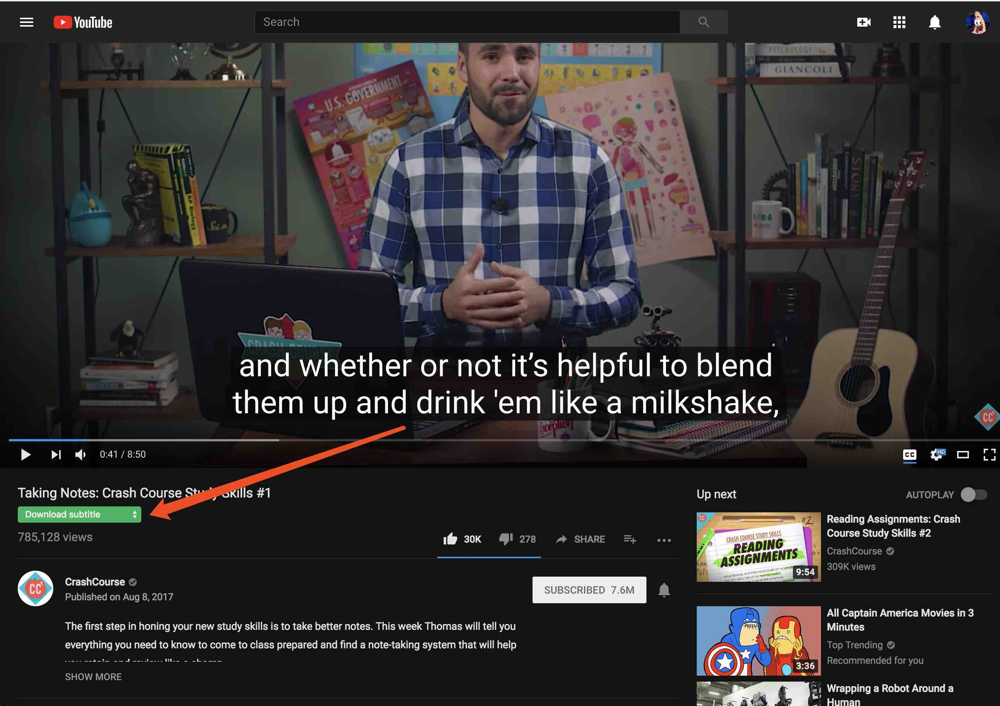
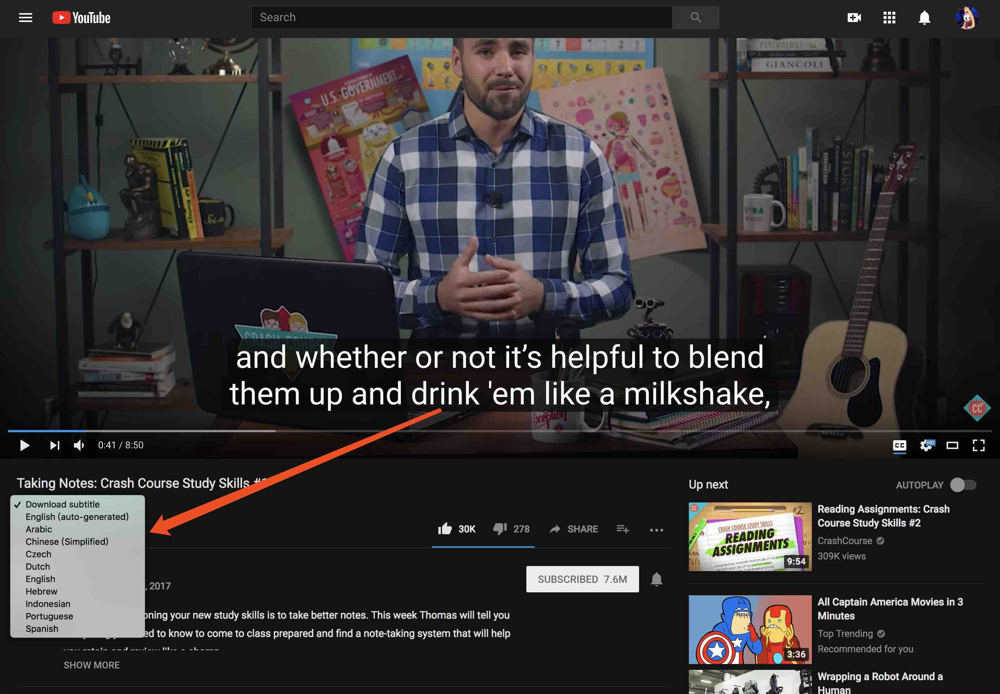
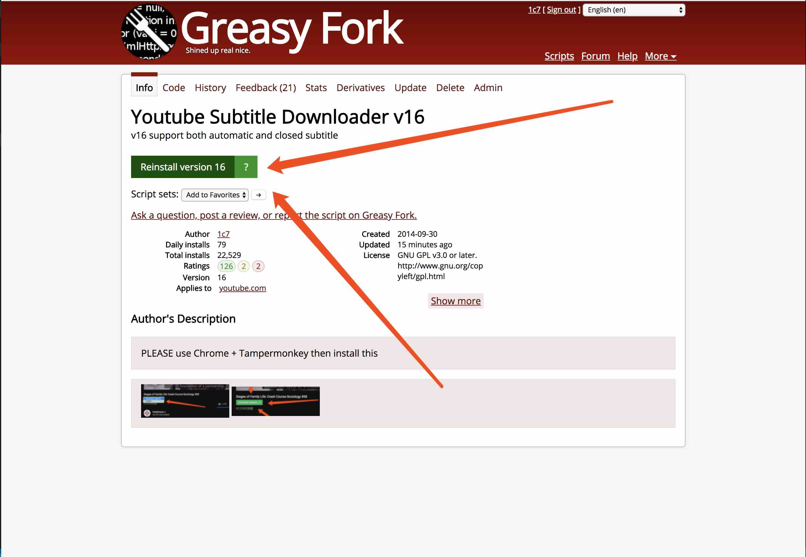
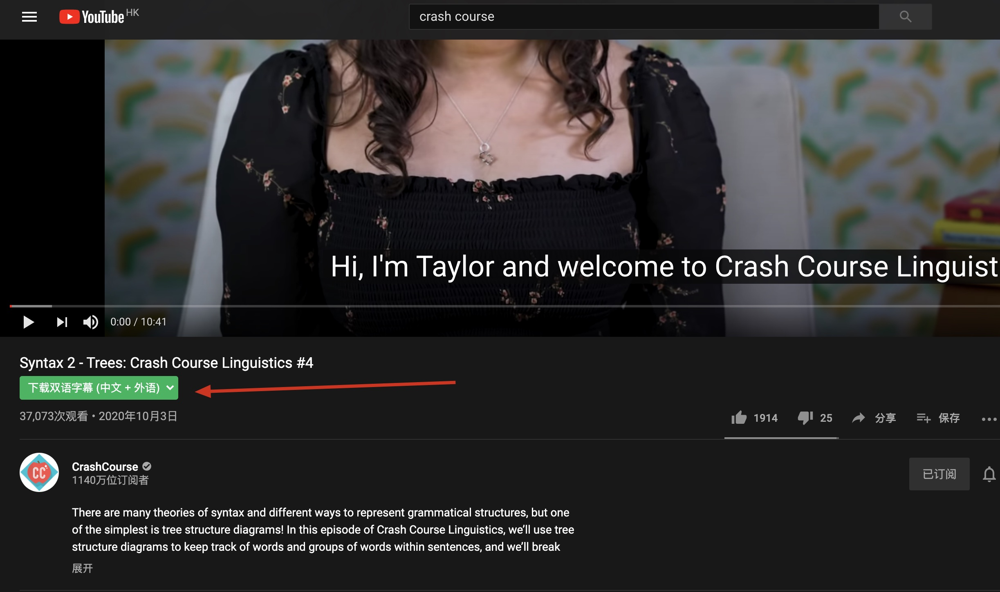
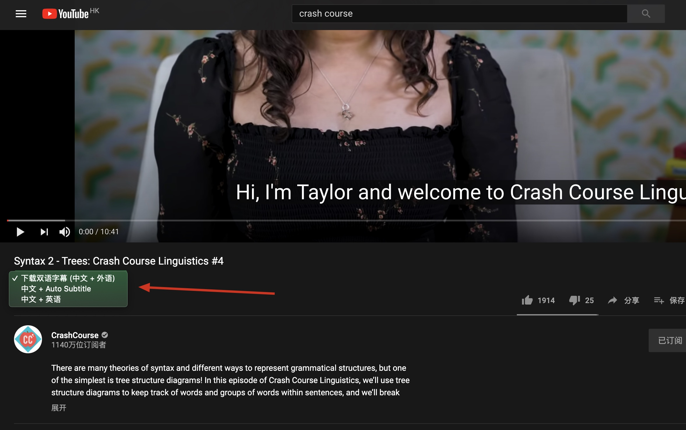
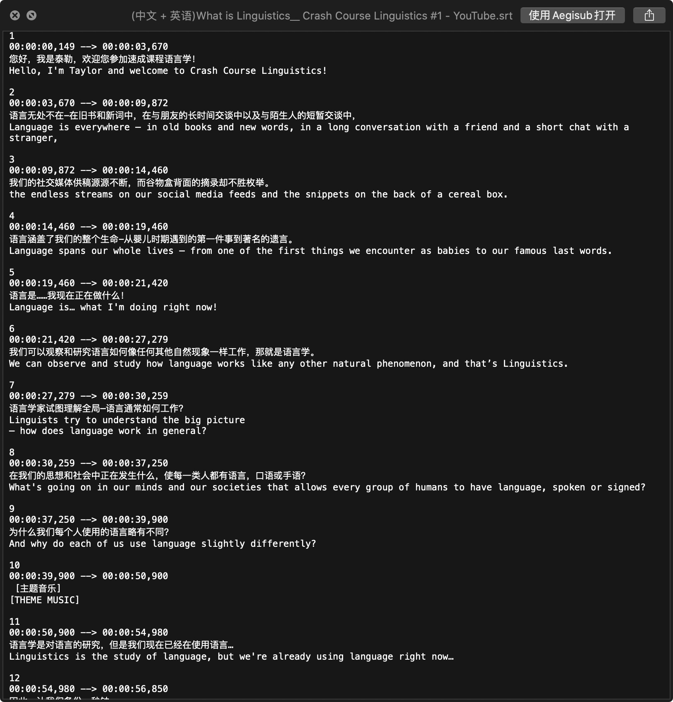
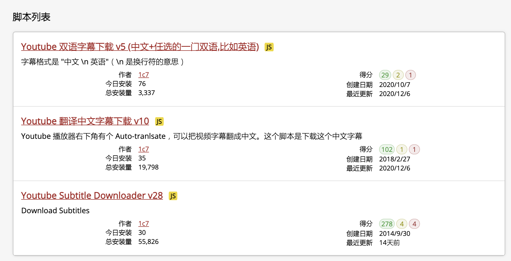

# Download Youtube Subtitle (auto-generated & closed)
## After install, it look like this:  
          
          

## Step 1: Install [Chrome](https://www.google.com/chrome/browser/) and [Tampermonkey](https://chrome.google.com/webstore/detail/tampermonkey/dhdgffkkebhmkfjojejmpbldmpobfkfo?utm_source=chrome-ntp-icon)  

## Step 2: Install this script
[Youtube Subtitle Downloader](https://greasyfork.org/scripts/5368-youtube-subtitle-downloader) 
   
Click Green "Install" button

 

---

 

# Youtube 字幕下载工具
这里的程序是用来下载 Youtube 字幕的.         
具体的安装和使用请参考 [这篇详尽的知乎回答](http://www.zhihu.com/question/19647719/answer/16843974?group_id=789328566)      
答主是我

## 感谢使用！
有疑问或建议，可邮件联系我：guokrfans#gmail.com (# 换成 @)

# 双语字幕下载
[Youtube 双语字幕下载 (中文+任选的一门双语,比如英语)](https://greasyfork.org/zh-CN/scripts/412614-youtube-%E5%8F%8C%E8%AF%AD%E5%AD%97%E5%B9%95%E4%B8%8B%E8%BD%BD-v2-%E4%B8%AD%E6%96%87-%E4%BB%BB%E9%80%89%E7%9A%84%E4%B8%80%E9%97%A8%E5%8F%8C%E8%AF%AD-%E6%AF%94%E5%A6%82%E8%8B%B1%E8%AF%AD)

       
       
       

## 说明
这里的字幕下载可以说是很齐全了
1. 可以下载原语言（英语，中文，德语，法语等等）（单语）
2. 可以下载原语言翻译成中文后（单语）
3. 可以下载中文+外语两种语言一起的字幕（双语）

  

https://greasyfork.org/zh-CN/users/5711-1c7   
自己按需使用即可  
可以3个都安装了，然后按需启用   

## 提示
如果无法下载字幕，建议关闭所有无关的 Chrome 插件, 关闭其他的 Tampermonkey 脚本  
只留下1个，再刷新页面试试   

## 重要时间点
* 2021-1-19 Youtube 的字幕翻译服务似乎出了问题，如果使用右下角的自动翻译功能（点击齿轮后弹出的菜单里）获得翻译后的字幕是404，比如视频语言是英文，点击自动翻译，选择中文（简体）会出错，得到404
这个问题是谷歌的问题，和我这个字幕下载脚本没有关系，我修复不了，要等他们修复
 
