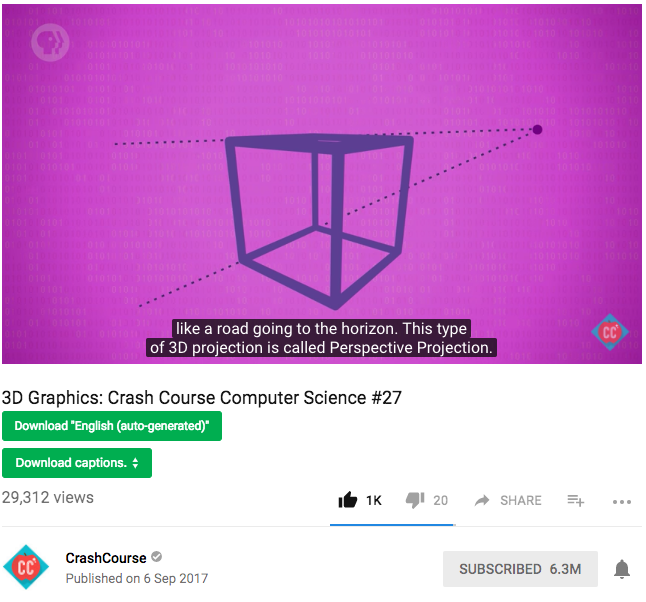

# Download Youtube Subtitle (auto-generated & closed)
Here is 2 little script help you download Youtube subtitle directly on the video play page (1 click - half second)   
(file format .srt)     
so you don't have to copy&paste Youtube URL into some website & watch ad & then get the file (at least 5 second)  

## How does it look like?
      
👆 2 green button. 👆
one for (auto-generated subtitle), one for (closed subtitle)

## How Do I Install?
### Step 1: you need [Chrome](https://www.google.com/chrome/browser/)(Browser) and [Tampermonkey](https://chrome.google.com/webstore/detail/tampermonkey/dhdgffkkebhmkfjojejmpbldmpobfkfo?utm_source=chrome-ntp-icon) (Chrome extension)

### Step 2: click 2 link down below and install both of them:

[Youtube Subtitle Downloader](https://greasyfork.org/scripts/5368-youtube-subtitle-downloader-v2) 
[Youtube Auto Subtitle Downloader](https://greasyfork.org/scripts/5367-youtube-auto-subtitle-downloader) 

You would see this (Click green "Install this script" button)  

then you would see this (click "Install" again to confirm):  

### Step 3: there are no step 3  

Thanks for using. I hope it save your time.  Have a nice day ;)    

### But I still feel confused, do you have video demonstrate? 
yes: https://youtu.be/_e9pGKO-V24  

### Project Background
* Creator: Cheng Zheng (born in 1995, Chinese)
* When? around 2014
* Why? I need download a lot subtitle at that time, and I just hate copy & paste url into website and watch bunch of ads to get the subtitle file.
* is Createor still maintaing this? Yes!

### Wow! This is pretty helpful, Can I buy you a coffee?
Sure! Thank you! 
https://www.paypal.me/1c7

### Support
it work on "classic" Youtube, not the "new material design" Youtube, PR is welcome.

### Contributor (Thanks all of them!)
[@cnbeining](https://github.com/cnbeining)    
[@772807886](https://github.com/772807886)   
[@sterpe](https://github.com/sterpe)

### Reference(Thank you! it help a lot!)
https://github.com/sterpe/yt-timedtext2srt

### How does it work? ( on code level )
https://youtu.be/SSNrUTuryDg
in this youtube video, I explain how subtitle downloader work.

---

### Youtube 字幕下载  (Chinese)

这里 2 个工具都是用来下载 Youtube 字幕的. （不是下载视频的）
安装和使用请参考:
http://www.zhihu.com/question/19647719/answer/16843974?group_id=789328566  
感谢使用.

## 感谢! 很有用，省时间，可以给你打赏点钱么？
😆  

这 2 个二维码是 2017 年 5 月加上的。  
从 2014 年开始到 2017 年这个项目都没赚钱。  
期间我时不时更新，修 bug，做客服在知乎和 Greasyfork 回答问题。动力当然是因为写的东西有人用，挺开心。  
加二维码当然不指望能赚多少，只是一种动力来源，Motivation，每个月能看到 1，2 块钱代表还有人用。打赏不打赏随意，开心就好。  
金额不用多大，发个 1 分钱冒个泡也挺好玩的。
感谢使用！  

# 感谢打赏！
* 感谢“向涛涛”在支付宝上打赏2元！

* 感谢“昊“在支付宝打赏10元！

* 感谢"向宏图"在支付宝上打赏2元！

* 感谢"思成"在支付宝上打赏 2.88 元！

* 感谢无名人士在微信上打赏 5 元！（我在微信上看不到是谁打赏的，只看得到 "二维码收款" 这几个字 ┑(￣Д ￣)┍）
