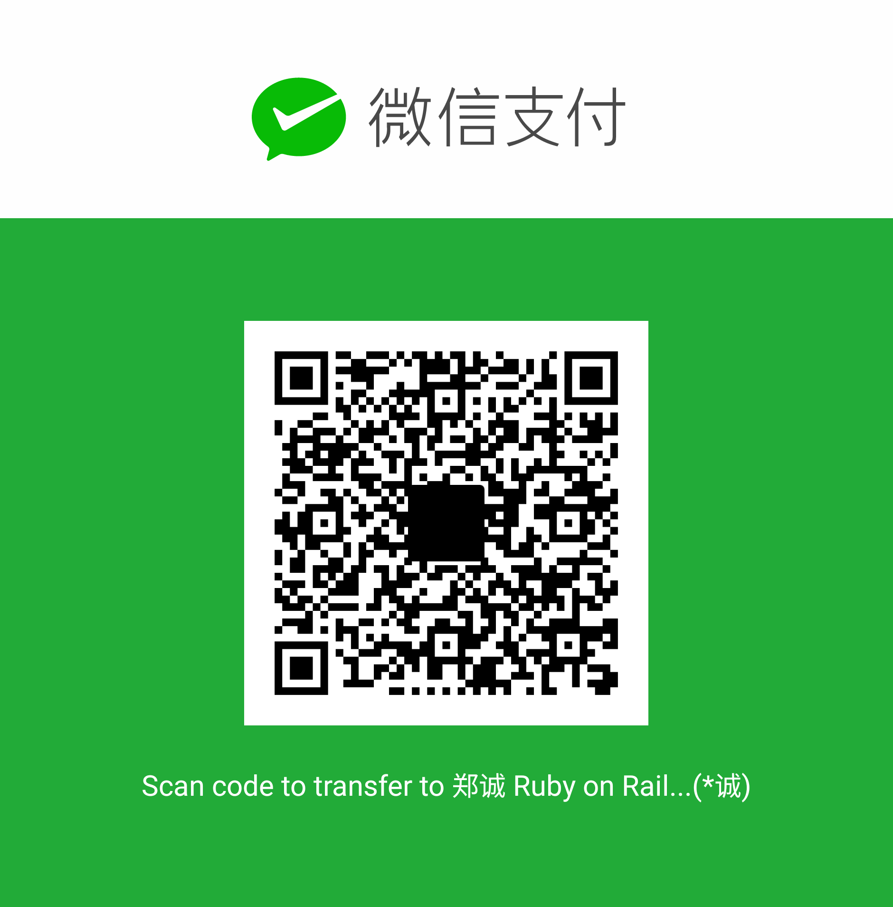

# Download Youtube Subtitle (auto-generated & closed)
## After install, it look like this:  
          
          

## Step 1: Install [Chrome](https://www.google.com/chrome/browser/) and [Tampermonkey](https://chrome.google.com/webstore/detail/tampermonkey/dhdgffkkebhmkfjojejmpbldmpobfkfo?utm_source=chrome-ntp-icon)  

## Step 2: Install this script
[Youtube Subtitle Downloader](https://greasyfork.org/scripts/5368-youtube-subtitle-downloader) 
   

Have a nice day :smile:  

---

## （中文说明）Youtube 字幕下载

这里的工具用来下载 Youtube 字幕 （不是下载视频的）
安装和使用请参考 [这篇知乎回答](http://www.zhihu.com/question/19647719/answer/16843974?group_id=789328566) 答主是我
 
感谢使用

## 打赏

这 2 个二维码是 2017 年 5 月加的。  
从 2014 年开始到 2017 年这个项目都没赚钱。  
期间我时不时更新，修 bug，做客服在知乎和 Greasyfork 回答问题。动力当然是因为写的东西有人用，挺开心。  
加二维码当然不指望能赚多少，只是一种动力来源，Motivation，每个月能看到 1，2 块钱代表还有人用。打赏不打赏随意，开心就好。  
金额不用多大，发个 1 分钱冒个泡也挺好玩的。
感谢使用！  

# 感谢打赏！
* 感谢“向涛涛”在支付宝打赏2元！

* 感谢“昊“在支付宝打赏10元！

* 感谢"向宏图"在支付宝打赏2元！

* 感谢"思成"在支付宝上打赏 2.88 元！

* 感谢无名人士在微信上打赏 5 元！（2017年9月3日，21:45:05）（我在微信上看不到是谁打赏的，只看得到 "二维码收款" 这几个字 ┑(￣Д ￣)┍）

* 感谢无名人士微信打赏 5 元！（2017年9月8日，周五，下午2点）

* 感谢无名人士微信打赏 2 元！（2017年9月20日，周三，上午10点）

* 感谢无名人士微信打赏 10 元！（2017年11月28日，周二，晚上6点)

* 感谢无名人士微信打赏 2 元！（2018年2月10日，周六，早上11点）
