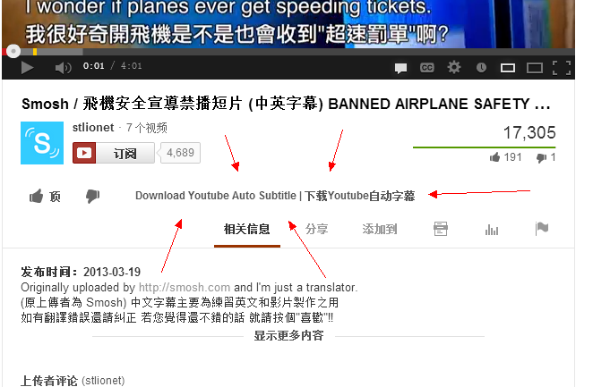
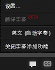
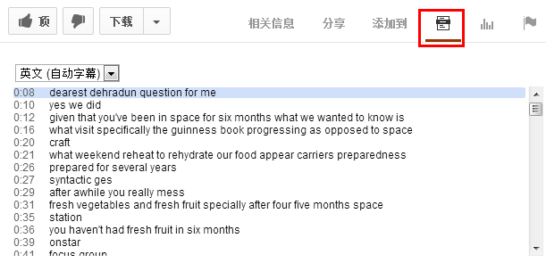
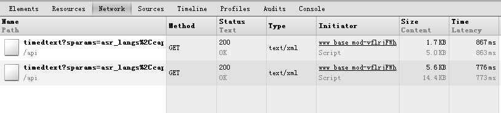
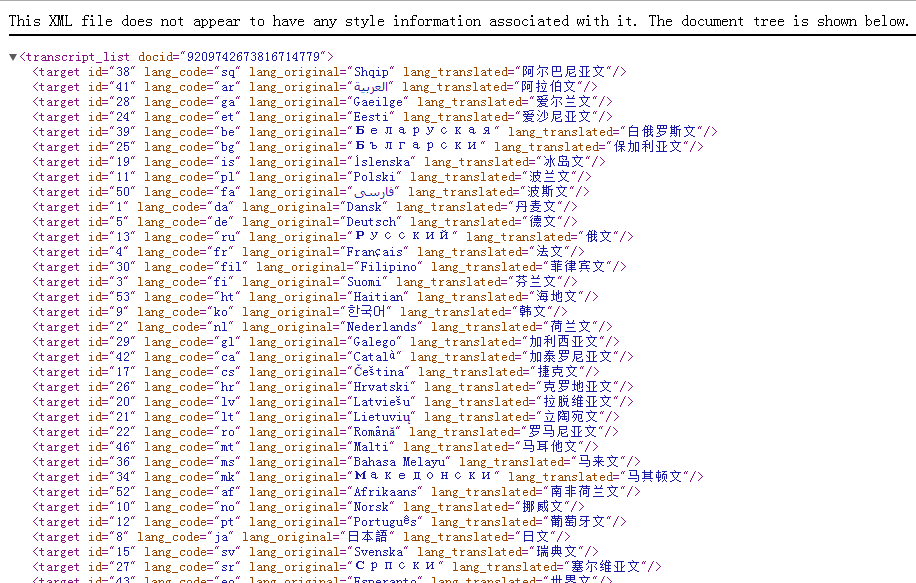
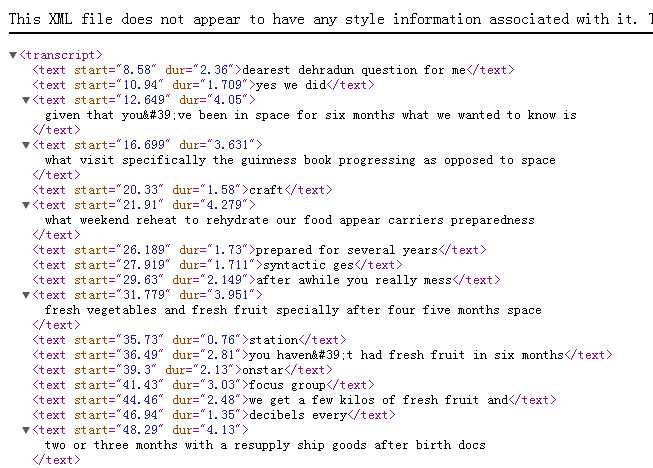
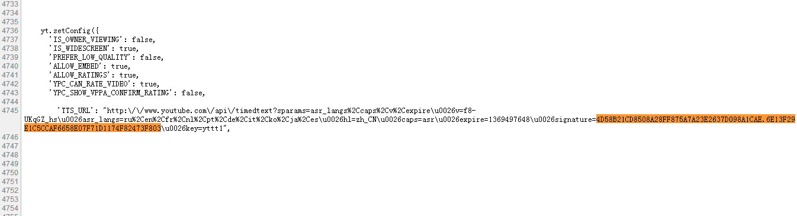
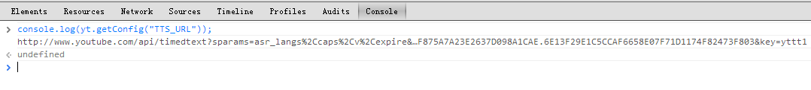

## English

#### Description
The tools help you download youtube auto subtitle.

 
#### Usage

1. install [Tempermonkey](https://chrome.google.com/webstore/detail/tampermonkey/dhdgffkkebhmkfjojejmpbldmpobfkfo?utm_source=chrome-ntp-icon)

2. install [Script](http://userscripts.org/scripts/show/168581)

3. when you Watch Youtube video, you will see this  
  

4. click it, download Auto subtitle file(format is srt).

 

---

 

## 中文

#### 程序说明:  

这个TemperMonkey脚本可以帮助你下载Youtube__自动__字幕.  
程序只负责下载自动字幕. 如果你想下载的视频已经有字幕了. 那么你可以去:  

* [http://www.yousub.net/](http://www.yousub.net/)
* [http://mo.dbxdb.com/](http://mo.dbxdb.com/)

 
#### 使用方法:

1. 安装 [Tempermonkey](https://chrome.google.com/webstore/detail/tampermonkey/dhdgffkkebhmkfjojejmpbldmpobfkfo?utm_source=chrome-ntp-icon)

2. 安装 [Script](http://userscripts.org/scripts/show/168581)

3. 当你看Youtube视频的时候, 你会发现页面下面会有这个按钮  
  

4. 点击这个按钮就能下载自动字幕文件(格式srt).

 
当然你也可以下载上面的Tempermonkey_Code.js, 然后黏贴到你的Tempermonkey里..
    

---

  
#### 程序原理:  

如果你用谷歌开发者工具->Network, 你会发现,  
不论是点击视频的CC图标, 调出字幕选择    
  

 
或是点击下面的"解说词":  
  

 
都会发出2个ajax请求:  
  

 
第1个请求:  
  
你会发现原来这是语言列表, 对我们来说这没用. 不管他.

 
来看第1个请求:  
  
很明显, 这是xml格式的自动字幕. 要的就是这个.

 
我们这个视频的Youtube地址是这样的:  
http://www.youtube.com/watch?v=f8-UKqGZ_hs

 
这个拿到xml字幕的URL是这样的(整理后的结果):  
http://www.youtube.com/api/timedtext?  
sparams=asr_langs%2Ccaps%2Cv%2Cexpire  
&v=f8-UKqGZ_hs  
&asr_langs=ru%2Cen%2Cfr%2Cnl%2Cpt%2Cde%2Cit%2Cko%2Cja%2Ces  
&hl=zh-CN  
&caps=asr  
&expire=1369497648  
&signature=4D58B21CD8508A28FF875A7A23E2637D098A1CAE.6E13F29E1C5CCAF6658E07F71D1174F82473F803  
&key=yttt1  
&type=track  
&lang=en  
&name  
&kind=asr  
&fmt=1  

 
 
你会发现 &v=f8-UKqGZ_hs, 跟视频的地址一样.  
但如果你仅仅拿视频地址拼接过去的话是没用的. 直接404. 拿不到xml格式的字幕.  

比如我们拿这个视频: http://www.youtube.com/watch?v=49TkVLRWKoc  
的 49TkVLRWKoc 替换掉v参数.  
直接404不商量.   

另外, 每个视频的 &signature 是不一样的, 我也不知道这个参数是干嘛的..  

 
 
### 不过这个问题最后是这样解决的:

我们在字幕里搜索这个 &signature, 看到了这个:
   

很明显这是个url, 但我们现在还不知道它们是干嘛的, 不论如何, 我们先拿到这个url再说.  
  

 
访问, 我们得到一片空白(页面上毛都没有, 也不报404).  
额, 那么到底是哪里出错了呢?  

 
我们随便访问一个视频, 看看它那个xml字幕的地址,

__Chrome->Network的观察结果:__  
http://www.youtube.com/api/timedtext?   
key=yttt1  
&signature=A036595CEB9C616474D9FB7359CFF04CE73A5652.E825F33880C201E070185ED945433C65007C51BF  
&caps=asr  
&hl=zh-CN  
&asr_langs=nl%2Ces%2Cru%2Cfr%2Cpt%2Cko%2Cit%2Cde%2Cja%2Cen  
&v=49TkVLRWKoc  
&sparams=asr_langs%2Ccaps%2Cv%2Cexpire  
&expire=1369488423  
&type=track  
&lang=en  
&name  
&kind=asr  

__console.log(yt.getConfig("TTS_URL"))的结果:__  
http://www.youtube.com/api/timedtext?  
key=yttt1  
&signature=A036595CEB9C616474D9FB7359CFF04CE73A5652.E825F33880C201E070185ED945433C65007C51BF  
&caps=asr  
&hl=zh_CN  
&asr_langs=nl%2Ces%2Cru%2Cfr%2Cpt%2Cko%2Cit%2Cde%2Cja%2Cen  
&v=49TkVLRWKoc  
&sparams=asr_langs%2Ccaps%2Cv%2Cexpire  
&expire=1369488423  

 
 

__差异点:__  
&type=track  
&lang=en  
&name  
&kind=asr  

 
那么是不是说, 我们只要通过 yt.getConfig("TTS_URL") 拿到地址, 然后拼接上这4个参数就行呢?  
我们试试看:  

console.log(yt.getConfig("TTS_URL"))的结果:  
http://www.youtube.com/api/timedtext?caps=asr&v=f8-UKqGZ_hs&expire=1369489805&asr_langs=en%2Cfr%2Cja%2Cko%2Cde%2Cpt%2Cit%2Cnl%2Cru%2Ces&hl=zh_CN&key=yttt1&signature=8AA3D6ED8FD4FCA8A7308B0FD7B942BB71817ABA.58A9E8D912282FE8BAC9FE1C120B328422AE48E5&sparams=asr_langs%2Ccaps%2Cv%2Cexpire

我们加上那4个参数:  
http://www.youtube.com/api/timedtext?caps=asr&v=f8-UKqGZ_hs&expire=1369489805&asr_langs=en%2Cfr%2Cja%2Cko%2Cde%2Cpt%2Cit%2Cnl%2Cru%2Ces&hl=zh_CN&key=yttt1&signature=8AA3D6ED8FD4FCA8A7308B0FD7B942BB71817ABA.58A9E8D912282FE8BAC9FE1C120B328422AE48E5&sparams=asr_langs%2Ccaps%2Cv%2Cexpire  
&type=track  
&lang=en  
&name  
&kind=asr  

 
#### 成功!!!!!!
#### 可以拿到自动字幕!!!!!!
#### 这就是拿xml自动字幕的技巧..不过这依赖于youtube程序员的yt.getConfig("TTS_URL"), 如果它改了, 比如换了个名字, 那我们也需要改.. 不过他们不太可能会更改.
 

----

 
### 结论:
在Youtube 视频页面下面运行 console.log(yt.getConfig("TTS_URL")) 拿到那个URL  

然后, 拼接上:   
&type=track  
&lang=en  
&name  
&kind=asr  

 
你就可以拿到xml格式的自动字幕了.  

比如:  

	var tts_url = yt.getConfig("TTS_URL");
	var xml_url = url + "&type=track" + "&lang=en" + "&name" + "&kind=asr"
	console.log(xml_url);
	// 你可以在控制台访问这个地址看看.

 
### 整个程序的流程是这样的:
1. 拿到xml字幕地址.
2. 用get方式访问这个地址, 拿到xml内容.
3. 拿Javascript解析成srt格式.
4. 下载.

 
 
 		
 
 